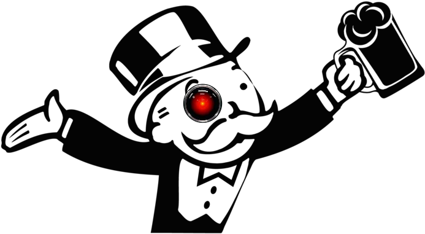

# Sell to AI

A game about product placement in the age of artificial intelligence.



## Setup

Backend is written in [FastAPI](https://fastapi.tiangolo.com/) and frontend in [Next.js](https://nextjs.org/).

### Backend

```
cd backend
pip install -r requirements.txt
uvicorn server:app --port=<PORT>
```

### Fronend

```
npm install
npm start
```
